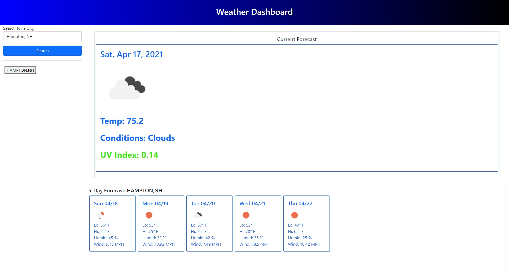

# weather-app

Sixth week's homework for UNH Full-Stack Web Development Boot Camp

## Description

The goal of this project was to create a weather app that would display the current weather and a five-day forecast for multiple cities. Our main tasks were to ensure that:

* When a city is searched for, current and future conditions are displayed and that city is added to a visible search history.

* When a city's weather is displayed, the city's name, the date, an icon for the weather condition, temperature, humidity, wind speed, and UV index are all visible.

* The UV index is displayed in a different color to signify whether the value is favorable, moderate, or severe.

* When a city's weather is displayed, a five-day forecast is visible that displays the date, an icon for the weather condition, the temperature, the wind speed and the humidity.

* When a city in the search history is clicked, it searches again for that city's weather. 

## Built with

* HTML
* CSS
* Javascript
* Days.js
* Jquery
* Bootstrap
* OpenWeather Weather and OneCall APIs

## Links

* [GitHub Repository](https://github.com/shabobble/weather-app)
* [Deployed Application](https://shabobble.github.io/weather-app/)

## Screenshots

# Installation

No installations required for this project.

## Credits

My full-stack web development course is being offered as a collaboration between Trilogy Education Services and UNH Professional Development and Training.

* Instructor - Benjamin Hutchins [GitHub](https://github.com/benhutchins)
* TA - Casey Ferguson [LinkedIn](https://www.linkedin.com/in/casey-a-ferguson/)